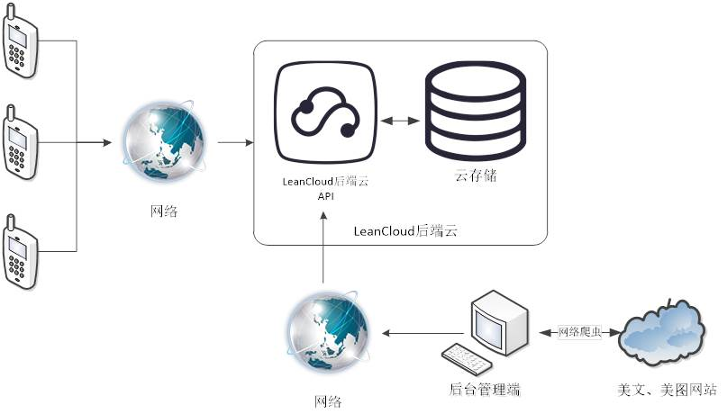

### ReadTime
一款基于iOS的用于阅读短篇心灵鸡汤类文章和欣赏精美图片的移动阅读APP。
### 介绍
应用软件采用C/S模式架构，分为iOS移动客户端和服务端两部分。 
iOS移动客户端主要实现两方面的内容，一方面为用户提供一个可以利用空闲时间来阅读、评论、分享和收藏短篇心灵鸡汤类文章和欣赏精美图片的手机阅读应用平台。
另一方面用户可以在应用平台上进行短篇文章创作，编写自己的文章上交后台审核。 
服务端采用后端云LeanCloud进行数据存储，后端的数据采集通过Python编写的程序来爬取相关精美短篇文章的网站的信息。 

