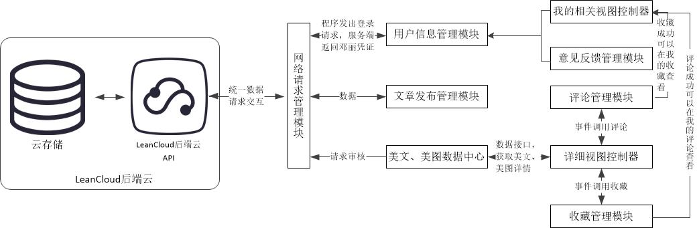
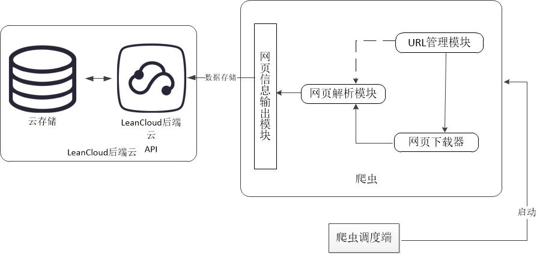

### ReadTime
一款基于iOS的用于阅读短篇心灵鸡汤类文章和欣赏精美图片的移动阅读APP。
### 项目介绍
应用软件采用C/S模式架构，分为iOS移动客户端和服务端两部分。 
iOS移动客户端主要实现两方面的内容，一方面为用户提供一个可以利用空闲时间来阅读、评论、分享和收藏短篇心灵鸡汤类文章和欣赏精美图片的手机阅读应用平台。
另一方面用户可以在应用平台上进行短篇文章创作，编写自己的文章上交后台审核。 
服务端采用后端云LeanCloud进行数据存储，后端的数据采集通过Python编写的程序来爬取相关精美短篇文章的网站的信息。 
### 项目设计
本项目中的移动客户端设备和Leancloud后端云及后端管理PC端之间的架构图如图4-1所示，所有移动客户端设备通过网络访问Leancloud后端云向外提供的API接口，达到相互交互。而后端管理PC端主要是通过网络爬虫爬取经过挑选的美文，美图网站的信息文章。再通过网络存放到Leancloud后端云提供的云存储上。 

项目架构图 

本项目系统的iOS客户端主要架构如图所示，用户首次使用应用程序时，可以以游客身份，也可以登录身份进入。当用户进行注册登录后，用户信息管理模块将把服务器返回的登录验证保存到NSUserDefaults中，下次进入时将默认后台登录。客户端中所有与后端云交互都统一通过使用网络请求模块来实现。网络请求管理模块管理着网络层数据传递包括请求和返回，对外提供业务层对接方式，除此之外设置了网络请求如何自动取消，错误处理。
项目中主要的两大类一是美文美图数据中心，提供网络请求向外获取数据，根据获取的数据展示到详情视图上。可通过评论管理模块和收藏管理模块对文章进行操作，操作结果将显示与用户信息管理模块下的我的相关视图中。另一大类是文章发布管理，将用户发布的文章通过网络请求模块发送至服务端。 

客户端架构设计图 

本项目系统的爬虫架构设计图如下，当后端数据的首页轮播图数据需要更新时，后端管理员将可以通过网页调度模块启动首页轮播图对应的数据爬虫来获取最新轮播图数据。当后端数据的专题获取其他数据部分需要数据存储时，后端管理员便确定对应数据部分的爬虫。

爬虫架构设计图 

### 实现效果图

